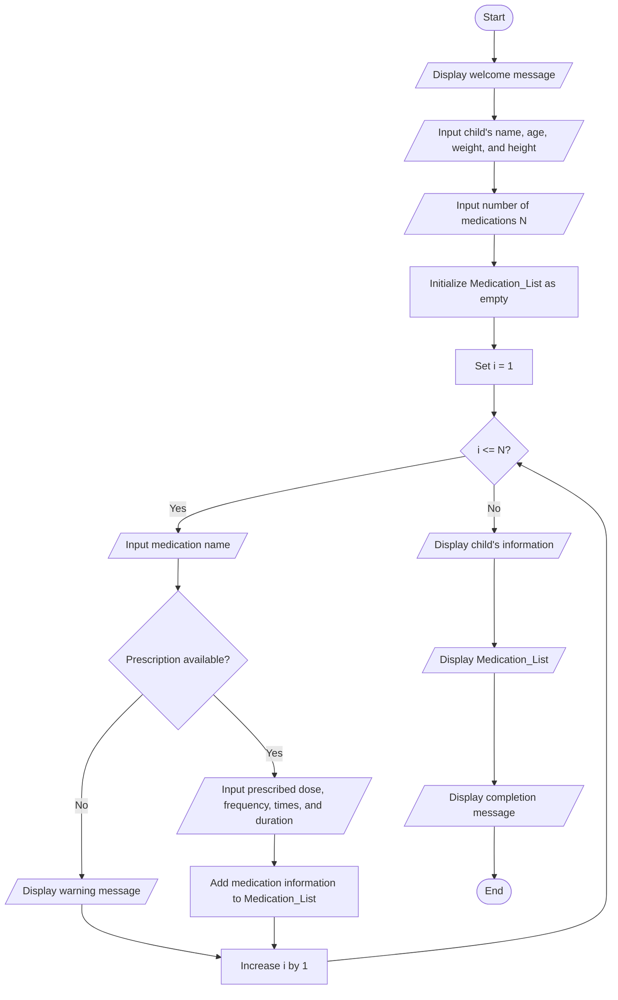

```mermaid
flowchart TD
    A([Start]) --> B[/Display welcome message/]
    B --> C[/Input child's name, age, weight, and height/]
    C --> D[/Input number of medications N/]
    D --> E[Initialize Medication_List as empty]
    E --> F[Set i = 1]
    F --> G{i <= N?}

    G -- Yes --> H[/Input medication name/]
    H --> I{Prescription available?}

    I -- No --> J[/Display warning message/]
    I -- Yes --> K[/Input prescribed dose, frequency, times, and duration/]
    K --> L[Add medication information to Medication_List]

    J --> M[Increase i by 1]
    L --> M
    M --> G

    G -- No --> N[/Display child's information/]
    N --> O[/Display Medication_List/]
    O --> P[/Display completion message/]
    P --> Q([End])
```
